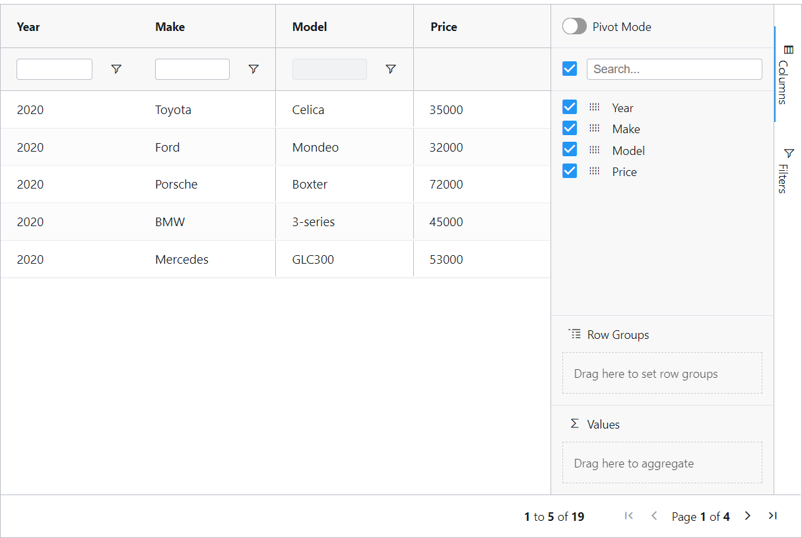
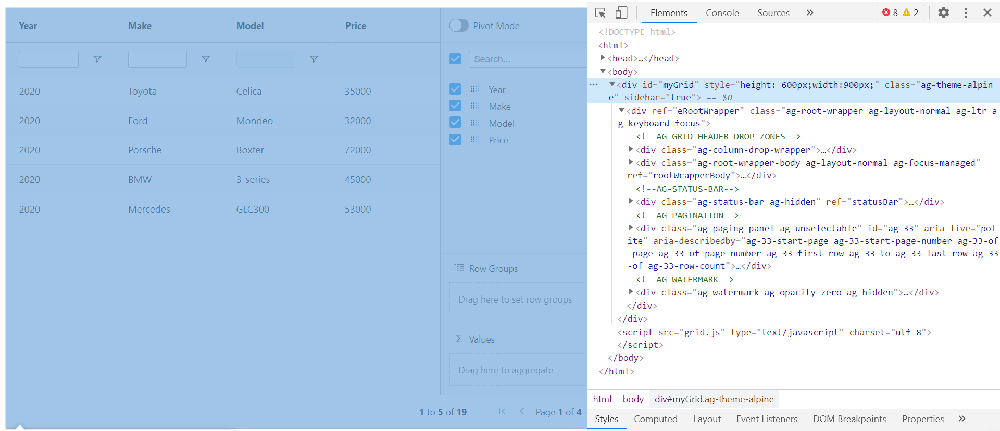

# wdio-ag-grid


WebdriverIO helpers for interacting with and validating AG Grid.

This package uses the shared `@kpmck/ag-grid-core` logic and exposes a WebdriverIO-friendly wrapper for common AG Grid behaviors.

## Installation

```bash
npm install wdio-ag-grid --save-dev
```

Then import the helper in your WebdriverIO tests:

```javascript
import { createAgGrid, filterOperator, sort } from "wdio-ag-grid";
```

## Usage

Consider the AG Grid example below:


With the following DOM structure:


Create a helper instance from the top-level AG Grid element:

```javascript
const grid = createAgGrid(await $("#myGrid"));
```

Read the grid as structured row data:

```javascript
const grid = createAgGrid(await $("#myGrid"));
const tableData = await grid.getData();
```

Filter, sort, and edit cells:

```javascript
const grid = createAgGrid(await $("#myGrid2"));

await grid.filterTextFloating({
  searchCriteria: {
    columnName: "Make",
    filterValue: "Porsche",
    operator: filterOperator.equals,
  },
  hasApplyButton: true,
});

await grid.sortColumn("Model", sort.ascending);

const priceCell = await grid.getCellLocator(
  { Make: "Porsche", Price: "72000" },
  "Price"
);

await priceCell.doubleClick();
await (await priceCell.$("input")).setValue("66000");
await browser.keys("Enter");
```

## Supported Capabilities

- get AG Grid data as structured objects
- return only selected columns
- sort and pin columns
- filter by text in menus and floating filters
- filter by checkbox values
- toggle columns from the sidebar
- edit grid cells with returned WDIO elements
- wait for AG Grid-owned animations to finish

## Monorepo Docs

- root landing page: [`README.md`](../../README.md)
- Cypress package: [`packages/cypress-ag-grid/README.md`](../cypress-ag-grid/README.md)
- Playwright package: [`packages/playwright-ag-grid/README.md`](../playwright-ag-grid/README.md)
- shared core: [`packages/ag-grid-core/README.md`](../ag-grid-core/README.md)
